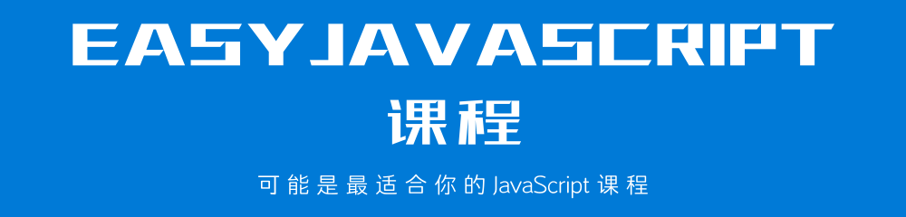

[在线阅读](http://www.longestory.com/easy-javascript/)

## 前言

本套课程共分为 10 个章节，从基础的概念到具体的用法，一一详细的进行阐述。只为努力作为学习 JavaScript 技术的最好的自学基础课程。

> **本套课程会一直更新，直到达到适合于所有人自学为止。**

10 个章节内容，大体上可以被分为以下几个部分内容:

> **说明:** 如果你已经掌握 JavaScript 中的部分内容，可以根据自己的情况选择性的进行学习。

### 第一部分: 概念

我们首先从第一章节概念入手，先掌握什么是 JavaScript、JavaScript 的运行环境以及如何进行代码调试。

这部分内容，是你学习 JavaScript 中后续内容的基础。概念清晰了，操作才会更顺手。学习概念，不仅仅只是单纯地阅读文字这么简单。要试着用自己的话来描述你所学习的概念，并把它发布到网络上，让别人替你检查，你的理解是否准确。

> 如果你不知道如何发布到网络上，可以加入底部的 QQ 讨论群，与其他人共同学习。

### 第二部分: 基础语法

从第二章到第五章，我们要掌握有关 JavaScript 的一些基础语法。这部分内容包含了一些最基本的语法内容、变量与常量、数据类型和运算符。

不要小瞧 JavaScript 的基础语法内容，这部分内容是我们学习使用 JavaScript 编程的根本。很多读者在学习这部分内容的时候，经常会忽略一些细节。这些往往都是将来我们使用 JavaScript 编程所遇到的错误。

这部分内容，作者会不断地更新补充。尽量做到面面俱到，让你在学习之后可以全面地掌握 JavaScript 的基础语法内容。

> 你可以 **star** 或者 **watch** 本课程，这样一旦有更新，GitHub 会通知你。

### 第三部分: 核心语法

这部分内容是从第六章到第十章，我们要掌握有关 JavaScript 的核心语法内容。这部分内容包含了语句、数组、函数、作用域以及对象。

学习这部分内容，需要读者既要理解概念，又要消化原理流程，还要动手进行操作。所以，这部分内容应该是本套课程最核心的部分，也是最难掌握的部分。

不过，不要灰心! 作者会在后续的更新中，加入大量适当的案例，帮助你更好地掌握这部分内容。

> 你可以 **star** 或者 **watch** 本课程，这样一旦有更新，GitHub 会通知你。

## 反馈

本套课程会尽量完善，编写过程中难免出现纰漏。你可以通过以下展示方式进行反馈，作者会根据反馈及时更新和修改。

## 交流

你可以扫描下方的二维码，加入本套课程的 QQ 讨论群，与其他童鞋一起学习交流。

## 版权

本套课程的文本内容免费开源，任何人都可以免费学习、分享，甚至可以进行修改。但需要注明作者及来源，并且不能用于商业。

本套课程采用<a rel="license" href="http://creativecommons.org/licenses/by-nc-nd/4.0/">知识共享署名-非商业性使用-禁止演绎 4.0 国际许可协议</a>进行许可。

 