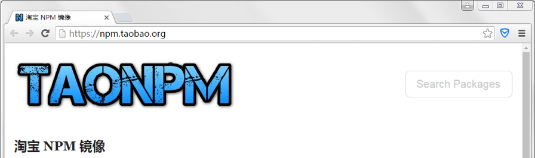

代码调试，是我们使用 JavaScript 语言编程过程中一项不可缺少的环节。虽然这并不是什么技术内容，但在实际开发中，依旧起着很重要的作用。

接下来，就让我们看一看基于 Node.js 环境的一些调试手段有哪些。

## console 控制台

console 用于提供控制台标准输出，它是由 Microsoft 公司的 JScript 引擎提供的调试工具，后来逐渐成为浏览器的标准，而独立 JavaScript 解释器 Node.js 也沿用了这个标准。

| 方法 | 描述 |
| --- | --- |
| console.log() | 向标准输出流打印字符并以换行符结束 |
| console.info() | 向标准输出流打印信息性消息。输出文字外，会显示一个蓝色的惊叹号 |
| console.warn() | 向标准输出流打印警告性消息。输出文字外，会显示一个黄色的惊叹号 |
| console.error() | 向标准输出流打印错误性消息。输出文字外，会显示一个红色的叉子 |

## Node.js 调试器

基于 Chrome V8 引擎的 Node.js 解释器提供了一个强大的调试器，帮助开发人员调试应用程序。

#### 1. 在 JavaScript 代码中添加 debugger 语句，debugger 语句相当于在代码中标注一个断点。

```javascript
var str = "这是一个测试内容."; // 定义一个用于测试的变量
debugger; // 添加debugger语句
console.log(str); // 输出测试内容

```

#### 2. 以 debug 方式运行 JavaScript 代码:

```
node debug debugger.js
```

## node-inspector

node-inspector 模块为在 Node.js 解释器中调试 JavaScript 代码提供了另一种选择，比 Node.js 内建的 debugger 强大很多。

#### 1. 使用 npm 安装 node-inspector 模块:

```
npm install -g node-inspector
```

#### 2. 启动 inspector 服务，实现通过浏览器连接 node-spector:

```
node-inspector
```

#### 3. 以 debug 方式运行 JavaScript 代码:

```
node --debug-brk 03_inspector.js
```

#### 4. 使用 Chrome 浏览器通过以下地址进行调试代码:

```
http://127.0.0.1:8080/?port=5858
```

> **注意:** node-inspector 模块目前只能使用 Chrome 浏览器，其他浏览器无任何效果。


## 附录

### node-inspector 安装失败问题解决

#### 安装失败原因:

node-inspector 模块是通过 npm 方式在线安装，而 npm 的镜像是在国外，由于国内的一些特殊情况可能会导致安装失败。

#### 解决办法:

可以使用由淘宝提供的国内 npm 镜像进行替换，保证 node-inspector 模块安装成功。



### 淘宝 npm 使用

#### 1. 在命令行中输入以下命令，安装淘宝 npm 定制的 cnpm:

```
npm install -g cnpm --registry=https://registry.npm.taobao.org
```

#### 2. 通过淘宝 npm 定制的 cnpm 安装模块:

```
cnpm install [name]
```

> **注意:** 通过 npm 或 cnpm 方式安装镜像只能在线安装，所以确保当前系统环境可以连接互联网。