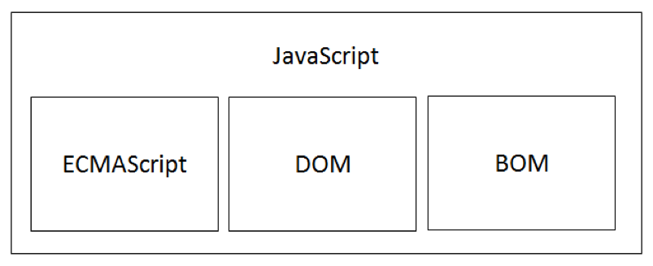

JavaScript 语言是一门跨平台、面向对象的轻量级脚本语言，运行于 JavaScript 解释器/引擎。

JavaScript 语言内置了一个包含一系列对象的标准库，比如数组、日期、数学和一个语言元素集合包括操作符、流程控制及语句等内容。

JavaScript 解释器是作为 JavaScript 脚本代码的运行环境，如下述两种呈现方式:

- 独立安装的 JavaScript 解释器。
- 嵌入在浏览器内核中的 JavaScript 解释器。

## JavaScript 简史

1992 年，Nombas 公司为自己的 CEnvi 软件开发了一款脚本语言 ScriptEase，可以嵌入在网页中。

1995 年， Netscape 公司为自己的 Navigator2.0 浏览器开发了另一种客户端脚本语言 Livescript，为了搭上当时很热 Java 的顺风车，临时把 LiveScript 改名为 JavaScript。

1996 年，Microsoft 公司在 IE3 中加入了 JScript（为避开 JavaScript 的版权问题）。

1997 年，JavaScript 1.1 作为草案提交给 ECMA（欧洲计算机制造商协会），完成了 ECMA-262 —— 定义了名为 ECMAScript 的脚本语言标准。

## JavaScript 实现

虽然 JavaScript 与 ECMAScript 经常被认为是相同含义，但 JavaScript 的含义要比 ECMAScript 多。一个完整的 JavaScript 实现应该由下列三个不同的部分组成:

1. 核心（ECMAScript）
2. 文档对象模型（DOM）
3. 浏览器对象模型（BOM）

## JavaScript 应用

### 客户端 JavaScript

通过提供控制浏览器及其文档对象模型（DOM）的对象来扩展语言核心。例如: 客户端版本直接支持应用将元素放在 HTML 表单中并且支持响应用户事件，比如鼠标点击、表单提交和页面导航。

### 服务器端 JavaScript

通过提供有关在服务器上运行 JavaScript 的对象来可扩展语言核心。例如: 服务端版本直接支持应用和数据库通信，提供应用不同调用间的信息连续性，或者在服务器上执行文件操作。

## 与 JScript 的关系

JScript 是 Microsoft 公司为 IE3 浏览器添加的脚本语言，也是 JavaScript 的另一种实现，只是 Microsoft 公司为了避免与 Netscape 公司的 JavaScript 语言产生版权问题，而命名为 JScript。

至此，JavaScript 实现意味着存在两个不同的版本: Netscape 公司的 JavaScript 和 Microsoft 公司的 JScript，当时没有任何标准规定 JavaScript 的语法和特性，导致开发人员在使用 JavaScript 的时候需要考虑浏览器的兼容性问题。

直到以 JavaScript 1.1 为草案提交给 ECMA（欧洲计算机制造商协会）定义了 ECMA 标准，这个问题才得以缓解。

> 参考资料: [MSDN 提供的 JavaScript 语言参考](https://msdn.microsoft.com/zh-cn/library/d1et7k7c.aspx)

## 与 Java 的关系

JavaScript 经常被误解为是 Java 的子集，实际上，这两种语言是完全不相干的。

JavaScript 与 Java 的语法很相似，就像 Java 和 C 语言的语法相似一样。JavaScript 最初被设计为运行在浏览器中的脚本语言，而 Java 是一种跨平台语言，目前主要应用于服务器端运行。

JavaScript 随着 Netscape 公司的战略而改变为 LiveScript，直到 1995 年 12 月 Netscape 公司与 SUN 公司才正式、公开地发布声明，LiveScript 语言更改为 JavaScript。

而 JavaScript 之所以改名，只是因为当时的 Java 语言很火而已。

## ECMAScript 介绍

JavaScript 的核心语言是 ECMAScript，ECMAScript 是由 ECMA（欧洲计算机制造商协会）定义的标准化脚本语言，与 Web 浏览器没有依赖关系。ECMAScript 不仅可以运行在内建 JavaScript 引擎的浏览器中，也可以运行在独立的 JavaScript 解释器中（例如 Node.js）。

ECMAScript 规定了下列组成部分：语法、类型、语句、关键字、保留字、操作符及对象等。

JavaScript 实现了 ECMAScript，其他脚本语言同样实现了 ECMAScript（例如 Adobe 公司的 ActionScript 语言）。
