JavaScript 语言目前比较主流的运行方式有两种。

一种是基于浏览器环境，这也是 JavaScript 最初也是最主流的一种运行方式。但由于目前网络环境越发复杂，可以内嵌浏览器的环境也越来越多。例如 PC 端浏览器、移动端浏览器、微信内置浏览器等。

一种是基于解释器环境，这种方式目前主要是以 Node.js 环境为主的环境。

## 基于浏览器

基于浏览器环境的这种方式，我们目前的测试是使用了浏览器自带的开发者工具实现的。这里我们主要测试 Chrome 浏览器和 Firefox 浏览器，当然其他浏览器也都提供了相关功能。

### Chrome 浏览器

我们可以通过 Chrome 浏览器提供的开发者工具的 console 功能测试 JavaScript 代码，如下图所示:

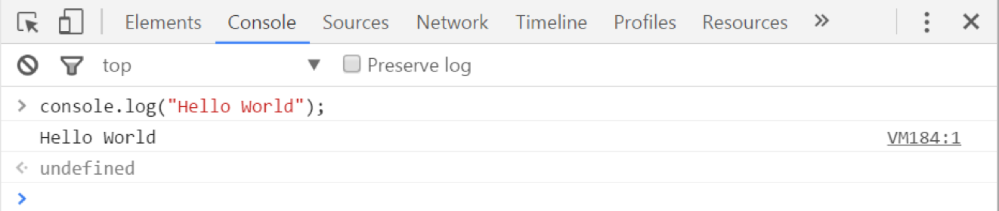

---
#### Chrome 浏览器如何开启开发者工具

##### 1. 打开 Chrome 浏览器，点击右上角的【菜单】，如下图所示。

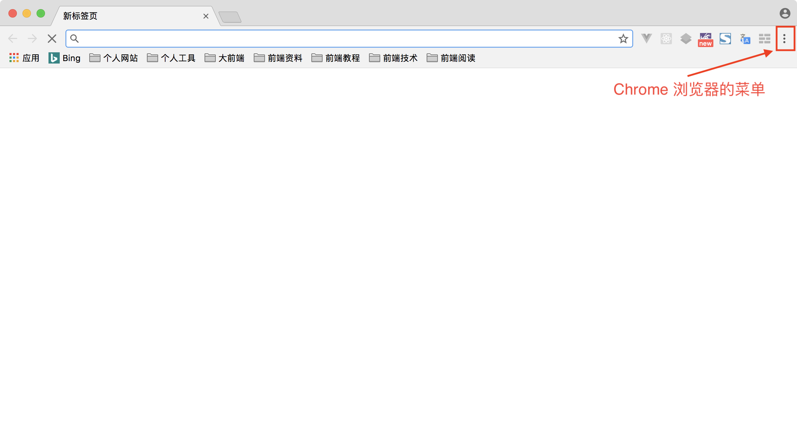

##### 2. 在弹出的窗口中，选择【更多工具】中的【开发者工具】，如下图所示。

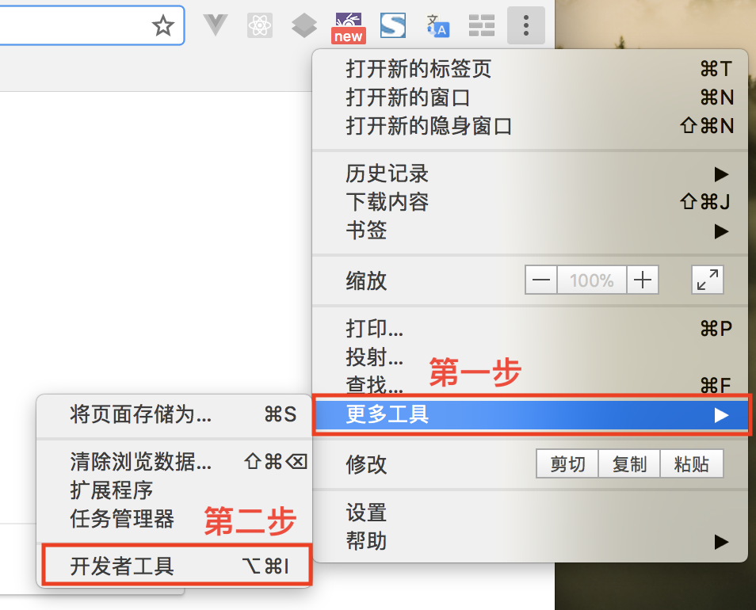

这时在 Chrome 浏览器的窗口中可以看到【开发者工具】的界面，如下图所示。

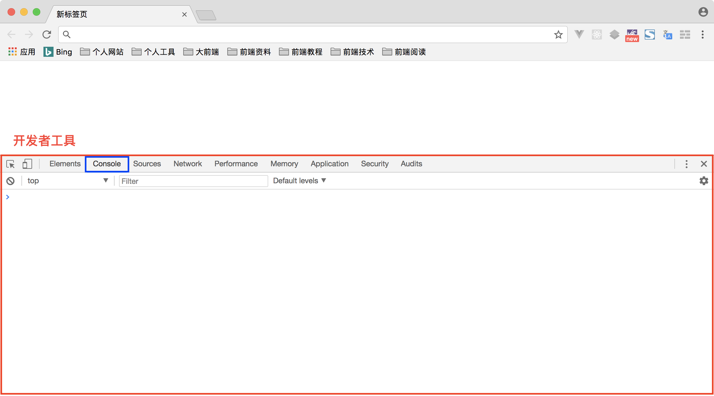

> **说明:** Chrome 浏览器的【开发者工具】功能也可以通过快捷键方式打开，但不同操作系统的不同版本的快捷键可能不相同。

---

### Firefox 浏览器

我们也可以通过 Firefox 浏览器提供的开发者工具的控制台功能测试 JavaScript 代码，如下图所示:

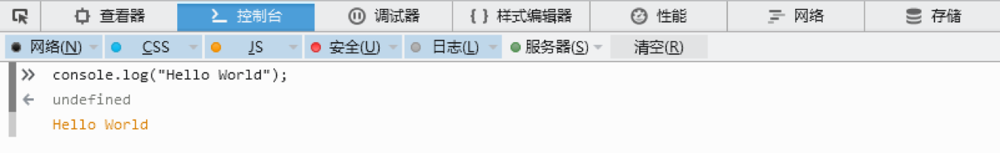

---
#### Firefox 浏览器如何开启开发者工具

##### 1. 打开 Firefox 浏览器，点击右上角的【菜单】，如下图所示。

##### 2. 在弹出的窗口中，选择【Web 开发者】选项，如下图所示。

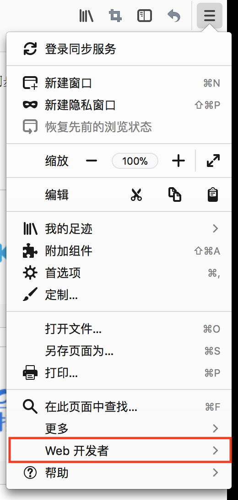

##### 3. 在弹出的窗口中，选择【Web 控制台】选项，如下图所示。

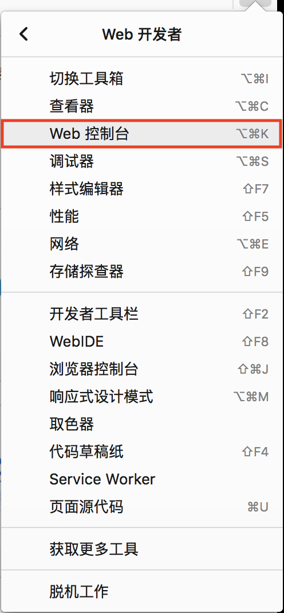

这时在 Firefox 浏览器的窗口中可以看到【开发者工具】的界面，如下图所示。

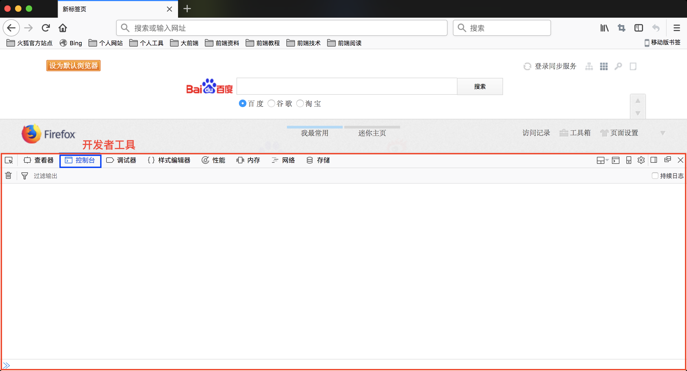

> **说明:** Firefox 浏览器的【开发者工具】功能也可以通过快捷键方式打开，但不同操作系统的不同版本的快捷键可能不相同。

---

## 基于解释器

独立的 JavaScript 解释器是非浏览器环境运行 JavaScript 脚本代码的环境。目前最流行的 JavaScript 解释器为 Node.js，Node.js 是一个基于 Chrome V8 引擎的 JavaScript 运行环境。

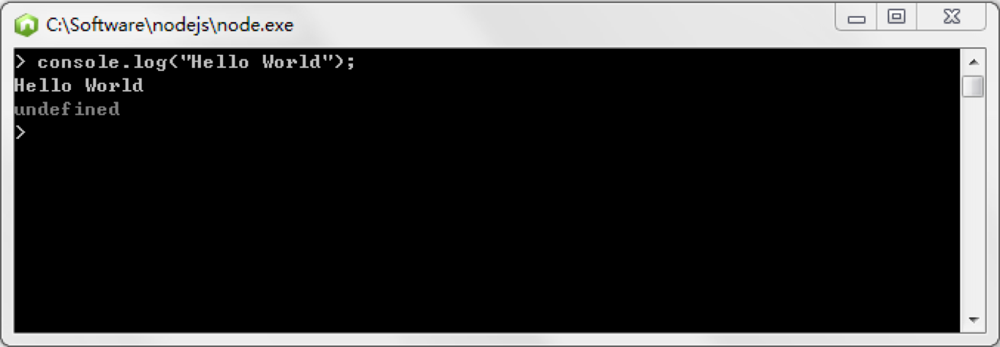

## 第一个程序

下面，我们通过 Node.js 环境运行第一个 JavaScript 程序。当然，这个程序并没有什么实际意义，只是让你先感受一下 JavaScript 语言。

#### 1. 点击程序 Node.js，运行 Node.js 命令行模式。

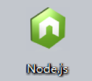

#### 2. 输入以下代码，回车进行运行，并查看结果。

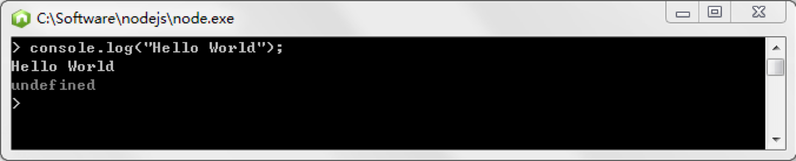