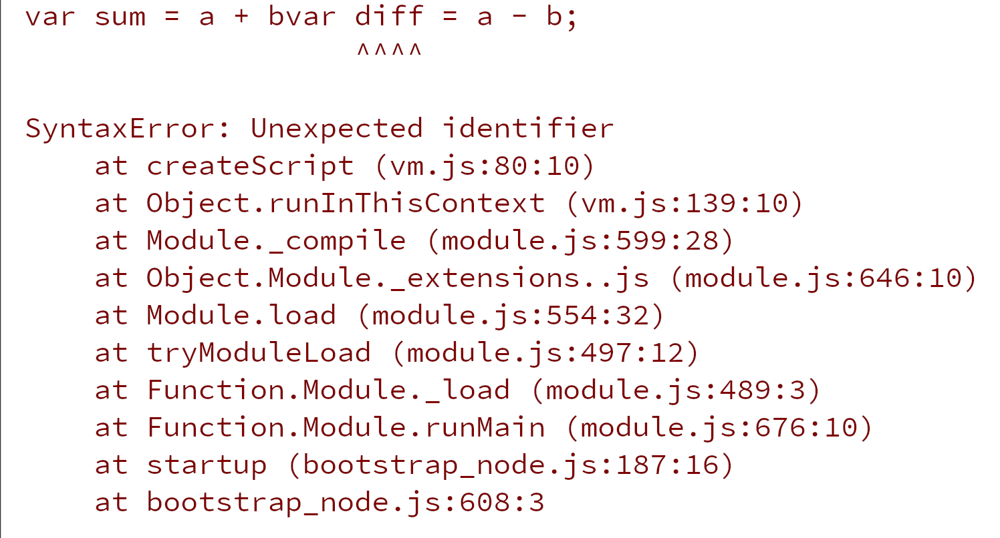

本节课程，我们将学习 JavaScript 语言的基础语法。这些虽然都是最基本的内容，但可以帮助我们养成一个良好的编程习惯。

## 区分大小写

JavaScript 是一种区分大小写的语言。这意味着 JavaScript 的关键字、变量名、函数名、以及任何其他的标识符必须使用一致的大小写形式。比如 longestory、Longestory 或 LONGESTORY 是不同的变量名。

```javascript
var longestory = "longestory";// 定义longestory变量
console.log(longestory);// 打印longestory变量
var Longestory = "Longestory";// 定义Longestory变量
console.log(Longestory);// 打印longestory变量
var LONGESTORY = "LONGESTORY";// 定义LONGESTORY变量
console.log(LONGESTORY);// 打印LONGESTORY变量
```

> **注意:** 在 JavaScript 中定义变量名和函数名时应该特别注意。

## 空格和换行

JavaScript 会忽略出现在代码中的空格、制表符和换行符。

由于可以自由地在代码中使用空格、制表符和换行符，所以采用争气、一直的缩进来形成统一的编码风格，从而提高代码的可读性显得尤为重要。

JavaScript 还可以识别水平制表符、垂直制表符、换页符等，JavaScript 将以下字符识别为行结束符: 换行符、回车符、行分隔符、段分隔符等。回车符加换行符在一起被解析为一个单行结束符。

## 可选的分号

JavaScript 的语句一般是以一个分号作为结尾。当然，JavaScript 也允许忽略这个分号。如果省略分号，则由解释器确定语句的结尾，

如下述示例代码所示:

```javascript
var sum = a + b// 即使没有分号也是有效的语句 —— 不推荐
var diff = a - b;// 有效的语句 —— 推荐
```

> **注意:** 在 JavaScript 中，虽然语句结尾的分号不是必需的，但还是建议任何时候都不要省略。使用分号是一个非常好的编程习惯。

如果将上述示例代码编写在一行的话，如下示例代码所示:

```javascript
var sum = a + bvar diff = a - b;
```

上述示例代码运行的结果是报错，具体报错信息如下图所示:



## 注释

在编写 JavaScript 代码时，经常利用注释为代码添加说明。注释的内容会被 JavaScript 解释器/引擎忽略，JavaScript 支持两种格式的注释:

#### 单行注释

```javascript
// 这里是单行注释
```

#### 多行注释

```javascript
/*
 * 这里是多行注释
 */
```

> **注意:** 上述注释的第二行是以星号开始，但这并不是必需的。

## 语句

JavaScript 代码将多行组合成一个代码块，每个代码块一般是以左花括号（{）开始，以右花括号（}）结束。

如下述示例代码所示:

```javascript
if(test){
	test = false;
	console.log(test);
}
```

> **注意:** 一般在执行多行代码时才需要语句块，但最好是始终都使用花括号将代码块进行包裹。

在 JavaScript 代码中，如果独立编写一个语句的话，JavaScript 语法并不报错。如下示例代码所示:

```javascript
{
    console.log(test);// 推荐使用
}
```

但是，我们并不推荐这样使用。因为在 ECMAScript 5 版本中，并不存在块级作用域。