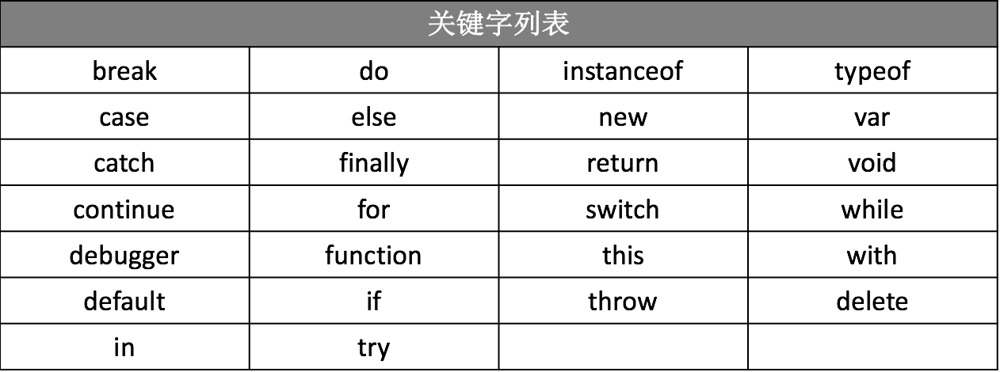
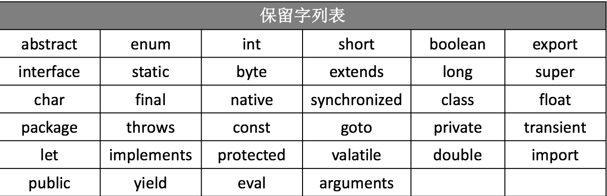

JavaScript 语言的关键字和保留字，简单理解就是具有特殊含义的字符，你在定义变量、函数和对象名称时不能使用的。

> **注意:** 随着 JavaScript 版本的更新，保留字可能会成为关键字。所以，这里所说的关键字和保留字是具有时效性的。

## 关键字

JavaScript 定义了一组具有特定用途的关键字，这些关键字可用于表示语句的开始或结束、或者执行特定操作等。也就是说，定义变量名或、函数名或对象名时不能使用这些名称。

## 保留字

JavaScript 除了定义了一组关键字，还定义了一组同样不能作为变量名、函数名或对象名的保留字。保留字可能在将来被作为新的关键字出现的。

