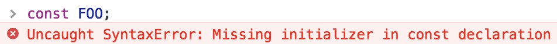

## 什么是常量

常量就是一个只读（read-only）的变量。常量与变量类似，同样用于存储数据信息。只是常量的数据一旦被定义，便不能被修改。

## 常量的声明

在 ECMAScript 5 版本前，没有定义常量的语法。使用 `var` 关键字定义变量，人为规定值不改变，也可以是不严格的常量。如下示例代码所示:

```javascript
var MY_CONST = 10;
```

> **说明:** 常量名习惯使用全大写形式。

这种方式只是人为规定常量，并不是语法规定。所以，这种方式定义的常量并不严谨！

在 ECMAScript 5 版本后，提供了关键字 `const` 定义常量。如下示例代码所示:

```javascript
const MY_CONST = 100;
```

> **注意:** 常量的声明，必须进行初始化操作，否则会报错误。

```javascript
const MY_CONST; // SyntaxError: missing = in const declaration
```

上述示例代码的运行结果为报错，具体的报错信息如下图所示:



> **说明:** 如果定义常量时，省略了关键字 `const` 的话，JavaScript 会认为是一个变量。

## 常量的使用

常量一旦被声明并初始化，值并不能被改变。常量的使用只能进行读取操作:

```javascript
// 定义常量 MY_CONST 并赋值 7
const MY_CONST = 7;

// 在 Firefox 和 Chrome 这会失败但不会报错(在 Safari 这个赋值会成功)
MY_CONST = 20;
console.log(MY_CONST); // 输出 7
const MY_CONST = 20; // 尝试重新声明会报错 
var MY_CONST = 20;// MY_CONST 保留给上面的常量，这个操作会失败
console.log(MY_CONST);// MY_CONST 依旧为 7
```

> **注意:** 上述示例代码具有时效性，浏览器版本不同，结果可能不同。