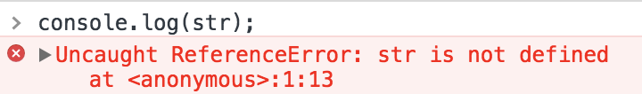

## 什么是变量

变量是存储数据信息的容器。变量被认为是有名字的容器。在代码中，使用变量名为值命名，需要遵守一定的规则。

> **注意:**
> 
> - 在 JavaScript 代码中，必须先声明一个变量，这个变量才能被使用。
> - JavaScript 中的变量是弱类型的，也称之为松散类型的。所谓弱类型/松散类型就是可以用来保存任何类型的数据。

如下示例代码，定义了一个变量 `v`，并重新赋值为 `string`:

```javascript
var v = 100;
v = "string";
```

上述代码只是展示了变量的用法，具体的使用我们将在下面的内容中学习。

## 变量的声明

在 JavaScript 代码中，使用变量前应当先声明。变量是使用关键字 `var` 声明的。

#### 1. 只声明未初始化，变量的值自动取值为 undefined

- 一行代码只声明一个变量:

```javascript
var sum;// 值为undefined
var msg;// 值为undefined
```

- 一行代码声明多个变量:

```javascript
var x, y, z;// 值为undefined
```

#### 2. 将变量的声明和初始化合写在一起

- 一行代码只声明一个变量并赋值:

```javascript
var sum = 100;// 值为 100
var msg = "this is message";// 值为 this is message
```

- 一行代码声明多个变量并赋值:

```javascript
var x = 0, y = 1, z = 2;
```

> **注意:** 等号（=）是赋值运算符。

### 命名规则

变量的命名需要遵守一定的规则的，具体规则如下:

- 必须以字母、数字、下划线（_）、美元符号（$）开始。
- 不能以数字开头。
- 不能使用关键字和保留字作为名称。
- 由于 JavaScript 是区分大小写的，大写字母与小写字母并不冲突。
- 名称最好有明确的含义。
- 可以采用“匈牙利命名法”、“下划线命名法”、“小驼峰命名法”或“大驼峰命名法” 之一，在开发团队内进行协调统一。

### 声明的问题

#### 1. 重复的声明

使用 `var` 关键字重复声明变量是合法且无害的。但是如果重复声明并初始化的，这就表示重复声明并初始化。由于 JavaScript 变量只能存储一个数据，之前存储的数据会被覆盖。

```javascript
var msg = "this is message";// 值为 this is message
var msg = 100;// 值为 100
```

#### 2. 遗漏的声明

直接读取一个没有声明的变量的值，JavaScript 会报错。

```javascript
console.log(str);// str 变量并没有声明
```

上述代码运行结果为报错，具体报错信息如下图所示:



> **注意:** 为一个没有声明的变量初始化，是合法的，但并不推荐这样使用。

## 变量的使用

对声明的变量既可以读取操作，也可以赋值操作。

#### 1. 读取操作

```javascript
var message;// 只声明未初始化
console.log(message);// 输出 undefined
var msg = “this is message”;// 声明并初始化
console.log(msg);// 输出 this is message
```

#### 2. 赋值操作

```javascript
var message;// 只声明未初始化
message = "this is message";// 初始化操作
var msg = "this is message";// 值会被覆盖
msg = "this is another message";// 重新赋值
```