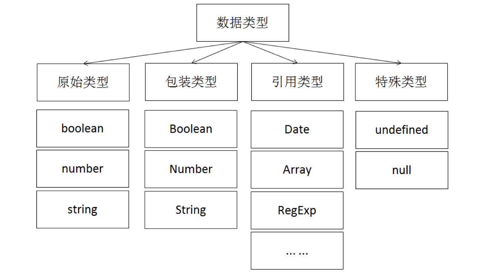

在 JavaScript 语言中，能够表示并操作值的类型称之为数据类型。

数据类型可分为可变类型和不可变类型。可变类型的值是可修改的，对象和数据就属于可变类型；不可变类型的值是不可修改的，数字、布尔值、null 和 undefined 都属于不可变类型。

字符串可以看成由字符组成的数组，可能被误认为是可变的。但在 JavaScript 中，字符串的值是不可变的。

## 数据类型分类

根据 ECMAScript 标准中的描述，数据类型被分为如下两种类型:

- 原始类型（又称原始值）
- 引用类型（又称内置对象）

但，为了可以更好地学习 JavaScript 语言的数据类型。所以，我们将原始类型再细分为**原始类型**和**特殊类型**。

> **说明:** 这里的特殊类型，并不是标准规范中的内容。只是为了方便我们进行区分而已。

再将引用类型细分为**包装类型**和**引用类型**。

> **说明:** 这里的包装类型，是参考了 Java 语言中对数据类型的分类方式。

所以，这里将 JavaScript 语言的数据类型，分成了如下图所示的方式:

> **说明:** 在本章节中，我们不会讨论引用类型。引用类型会在《JavaScript 面向对象》教程中详细讲解。