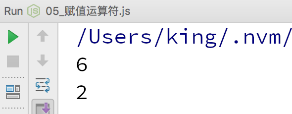

JavaScript 语言中的赋值运算符用于为变量或属性进行赋值操作。如下示例代码所示:

```javascript
var longestory = 'longestory';// 将字符串 "longestory" 赋值给变量 longestory

var obj = {}
obj.x = 1;// 将数字值 1 赋值给 obj 对象的 x 属性
```

赋值运算符就是将右边操作数的计算结果赋值给左边操作数。如下示例代码所示:

```javascript
C = A + B;// 将 A+B 的值赋给 C
```

## 赋值扩展运算符

| 运算符 | 描述 | 例子 |
| --- | --- | --- |
| += | 加等赋值运算符，将右边运算符与左边运算符相加并将运算结果赋给左边运算数 | C += A 相当于 C = C + A |
| -= | 减等赋值运算符，将左边运算数减去右边运算数并将运算结果赋给左边运算数 | C -= A 相当于C = C - A |
| *= | 乘等赋值运算符，将右边运算数乘以左边运算数并将运算结果赋给左边运算数 | C *= A 相当于C = C * A |
| /= | 除等赋值运算符， 将左边运算数除以右边运算数并将运算结果赋值给左边运算数 | C /= A 相当于 C = C / A |
| %= | 模等赋值运算符，用两个运算数做取模运算并将运算结果赋值给左边运算数 | C %= A 相当于 C = C % A |

> **注意:** C += A 由于运行时可以进行优化，执行效率都要优于C = C + A。

我们可以通过如下示例代码，测试两种写法的耗时:

```javascript
var num = 0;// 定义一个操作数
var startTime1 = new Date().getTime();// 获取代码执行之前的当前时间
// 循环 1000000 次，这样更好地测试结果
for (var i=0;i<1000000;i++) {
    num = num + 1;
}
var endTime1 = new Date().getTime();// 获取代码执行之后的当前时间
console.log(endTime1 - startTime1);// 输出用时

var num = 0;// 定义一个操作数
var startTime2 = new Date().getTime();// 获取代码执行之前的当前时间
// 循环 1000000 次，这样更好地测试结果
for (var i=0;i<1000000;i++) {
    num += 1;
}
var endTime2 = new Date().getTime();// 获取代码执行之后的当前时间
console.log(endTime2 - startTime2);// 输出用时
```

上述示例代码运行的结果，如下图所示:



> **说明:** 这里使用的时间单位是毫秒。