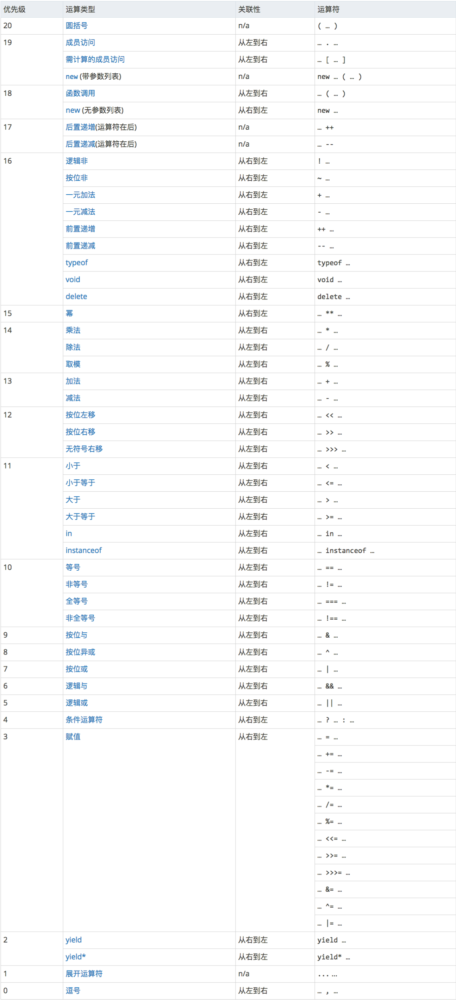

JavaScript 语言提供了一组用于操作数据值的运算符，又称为操作符。这些运算符可以按照作用的不同，或者操作变量数量的不同进行分类。

## 运算符的分类

#### 1. 如果按照作用的不同，运算符的分类如下所示:

- 算数运算符（+  -  *  /  %  ++  --）
- 比较运算符（>  >=  <  <=  ==  !=  ===  !==）
- 逻辑运算符（&&  ||  !）
- 赋值运算符（=  +=  -=  *=  /=  %=）
- 字符串连接运算符（+）
- 条件运算符（? :）
- 特殊运算符（typeof  instanceof  delete）

按照作用的不同进行分类，更容易理解掌握。所以，我们的教程采用这种方式进行分类。

#### 2. 如果按照操作变量的数量的不同，运算符的分类如下所示:

- 一元运算符（++  -- ! typeof  instanceof  delete）
- 二元运算符（+  -  *  /  % >  >=  <  <=  ==  !=  ===  !== &&  || =  +=  -=  *=  /=  %=）
- 三元运算符（? :）

## 运算符的优先级别

JavaScript 语言中的运算符，如果应用在复杂的表达式中的话，我们需要了解运算符的运算优先级别。说白了，就是先计算哪个运算符，再计算哪个运算符。

不了解运算符的计算优先级别，很可能导致最后的计算结果错误。

如下图所示，就是 JavaScript 语言的运算符的优先级别:



> **说明:** 上述展示运算符优先级别的图，来源 [MDN 社区](https://developer.mozilla.org/zh-CN/docs/Web/JavaScript/Reference/Operators/Operator_Precedence#Table)

我们并没有必要将上图中的运算符的优先级别全部记下来。这里有个小技巧，我们只需要知道小括号的计算级别是最高的就可以了。

在实际开发中，如果需要提前进行计算的，我们可以使用小括号进行包裹。如下示例代码所示:

```javascript
console.log((5 + 10) * 2);// 30，而不是 25
```