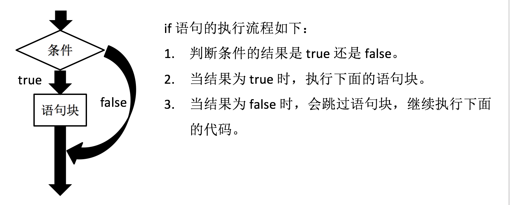
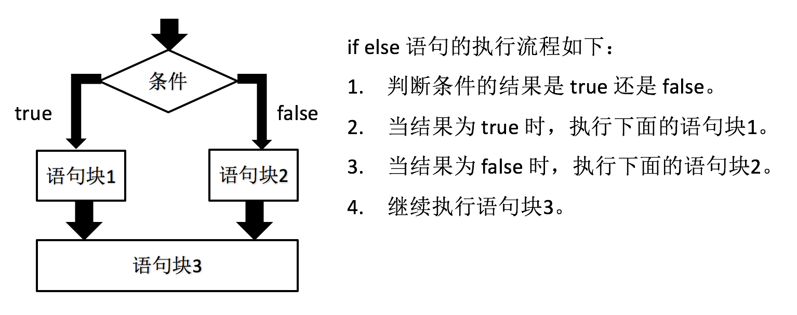
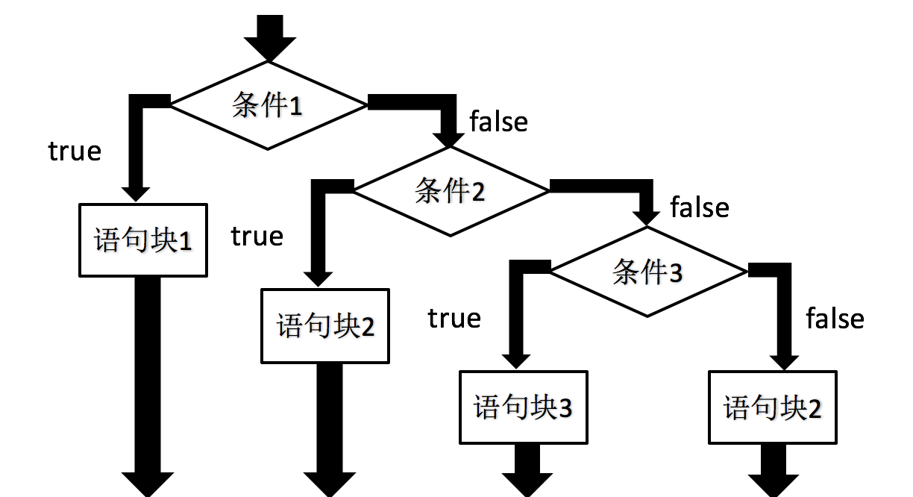
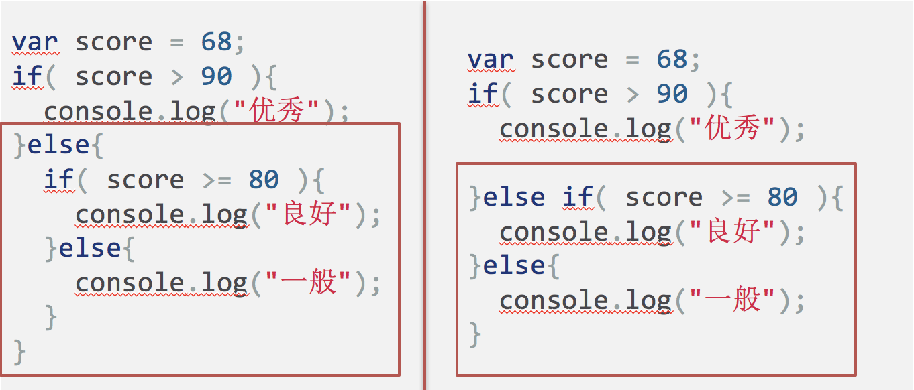
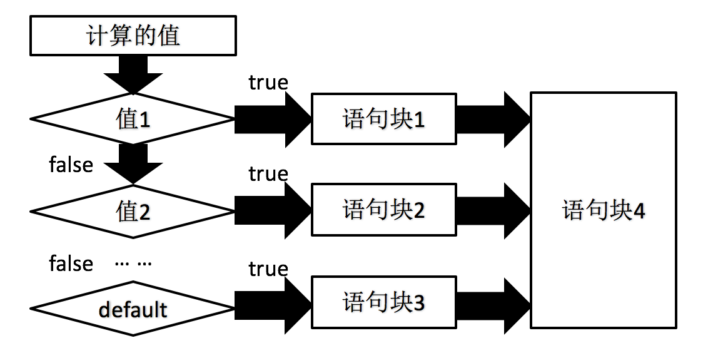

条件语句就是指通过判断指定的计算结果，来决定是执行还是跳过指定的语句块。

如果说 JavaScript 解释器是按照代码的“路径”执行的话，那条件语句就是这条路径上的分叉点，代码执行到这里时必须选择其中一条路径继续执行。

JavaScript 提供了两种条件语句: if else 语句和 switch case 语句。

## if 语句

if 语句是条件判断语句，也是最基本的流程控制语句。



我们可以通过如下示例代码，学习 if 语句的使用:

```javascript
var num = 5;
if( num < 10 ){
	console.log( num );
}
```

> **注意:**
> 
> - if 关键字后面的小括号不能被省略。
> - if 关键字后面的条件判断的结果必须是布尔值。如果结果为非布尔值的话，JavaScript 会自动转换为布尔值。
> - if 语句中的大括号（{}）可以被省略，但建议编写，以提高代码阅读性。

## if else 语句

if else 语句是条件判断语句，但与 if 语句的执行流程并不相同。



我们可以通过如下示例代码，学习 if else 语句的使用:

```javascript
var score = 68;
if( score < 60 ){
	console.log("不及格");
}else{
	console.log("及格");
}
```

> **注意:** if else 语句中的大括号（{}）可以被省略，但建议编写，以提高代码阅读性。

### if else 语句嵌套

if else 语句支持嵌套写法，也就是说，可以在 if 或 else 后面的语句块中继续编写 if else 语句。

如下述示例代码所示:

```javascript
var score = 68;
if( score > 90 ){
	console.log("优秀");
}else{
	if( score >= 80 ){
		console.log("良好");
	}else{
		console.log("一般");
	}
}
```

## else if 语句

else if 语句是在 if 语句的基础上，允许提供多个条件判断。



else if 语句实际上就是简化了的 if else 语句的嵌套写法。如下述代码:



## switch case 语句

switch case 语句是开关语句，但整体执行流程要比 if else 语句复杂的多。具体参考下述流程图:



```javascript
var num = 2;
switch( num ){
	case 1:
		console.log("查询余额");
		break;
	case 2:
		console.log("在线充值");
		break;
	default:
		console.log("转人工服务");
}
```

> **注意:** 在实际开发中，switch case 语句与 break 语句同时使用。

switch case 语句相对于 if else 语句执行性能更优，但也有很多需要注意的地方。
> **注意:**
> 
> - switch 关键字后面的小括号、case 关键字后面的冒号都不能被省略的。
> - break 语句是跳出语句，一旦被执行，表示后面所有的 case 和 default 语句都不会被执行。