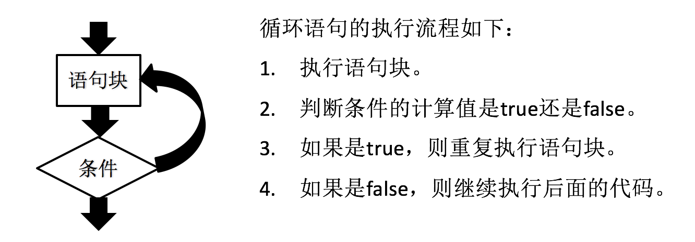
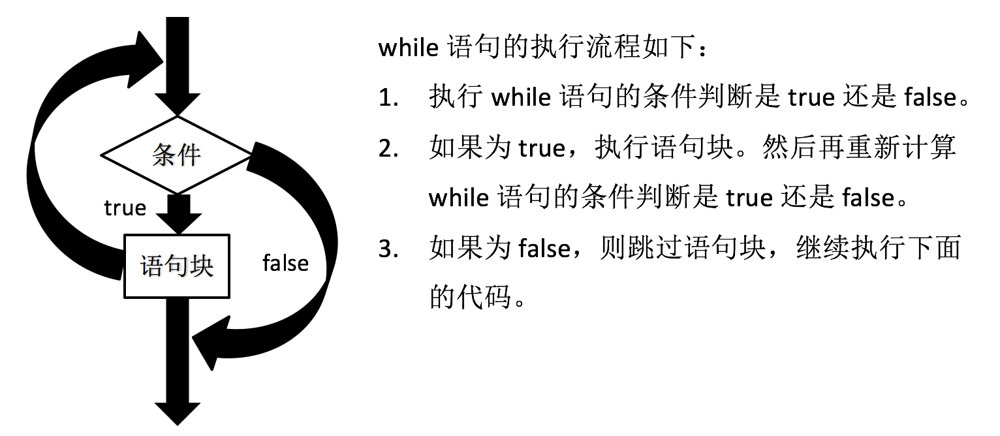
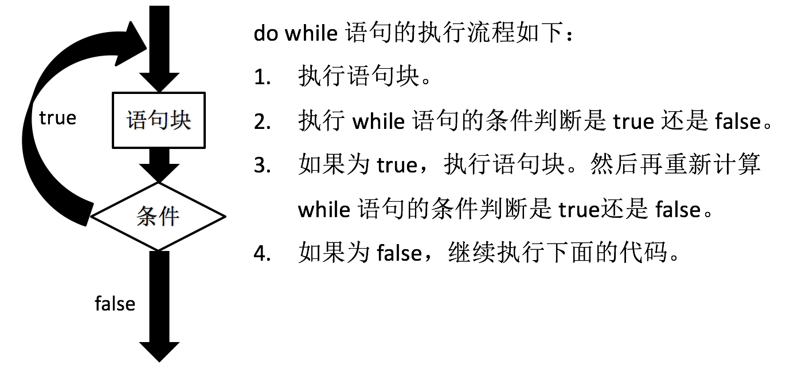
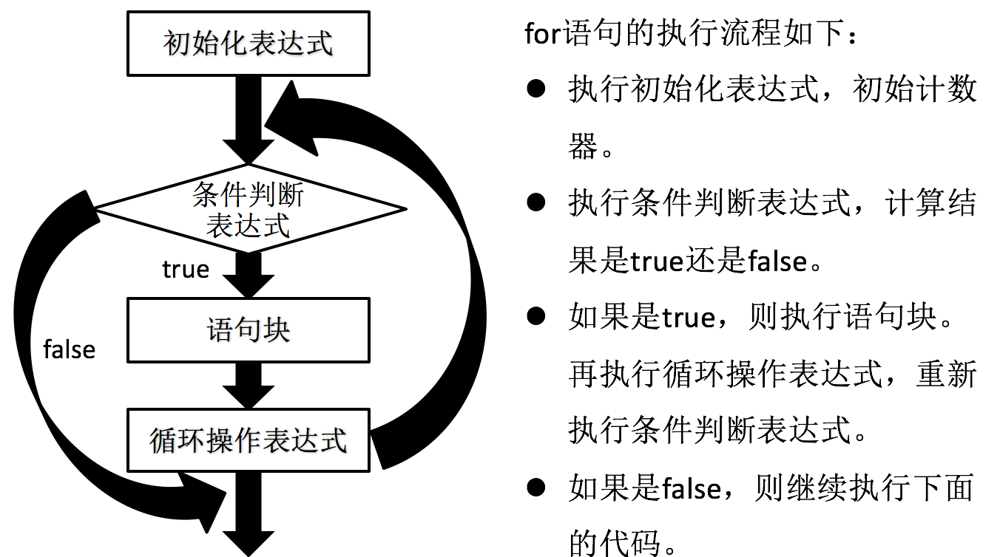

循环语句是一系列反复执行到复合特定条件的语句。为了更好地理解循环语句，可以将 JavaScript 代码想象成一条条的分支路径。循环语句就是代码路径中的一个回路，可以让一段代码重复执行。



## while 语句

while 语句是一个基本循环语句，语法结构与 if 语句很类似。



```javascript
var num = 0;
while( num < 10 ){
	console.log( num );
	num = num + 1;
}
```

> **注意:**
> 
> - while 关键字后面的小括号不能被省略。
> - while 关键字后面的条件判断的结果必须是布尔值。如果结果为非布尔值的话，JavaScript 会自动转换为布尔值。
> - while 语句中的大括号（{}）可以被省略，但建议编写，以提高代码阅读性。

## do while 语句

do while 语句也是一个基本循环语句，执行流程与 while 语句很类似。



```javascript
var num = 0;
do{
	console.log( num );
	num = num + 1;
}while( num < 10 );
```

> **注意:**
> 
> - while 关键字后面的小括号不能被省略。
> - while 关键字后面的条件判断的结果必须是布尔值。如果结果为非布尔值的话，JavaScript 会自动转换为布尔值。
> - while 语句中的大括号（{}）可以被省略，但建议编写，以提高代码阅读性。

## do while 与 while 语句的区别

do while 语句与 while 语句的差别极小:

- do while 语句: 先执行，再判断。
- while 语句: 先判断，再执行。

当 while 关键字后面的条件第一次被执行的时候，如果返回结果是 false 的话: while 语句的语句块一次都不会被执行；而 do while 语句的语句块至少被执行一次。

## for 语句

for 语句是一种最简洁的循环语句，其中包含三个重要部分:

- 初始化表达式: 初始化一个计数器，在循环开始前计算初始状态。
- 条件判断表达式: 判断给定的状态是否为 true。如果条件为 true，则执行语句块，否则跳出循环。
- 循环操作表达式: 改变循环条件，修改计数器的值。

for 语句的语法如下:

```javascript
if( 初始化表达式; 条件判断表达式; 循环操作表达式 ){
	语句块
}
```



### for 语句的特殊用法

for 语句的三个表达式都是允许为空的。

#### 1. 初始化表达式为空的情况

```javascript
初始化表达式
if( ; 条件判断表达式; 循环操作表达式 ){
	语句块
}
```

#### 2. 循环操作表达式为空的情况

```javascript
if(初始化表达式; 条件判断表达式; ){
	语句块
	循环操作表达式 
}
```

### 循环嵌套

循环嵌套就是在一个循环语句中包含另一个循环语句。

```javascript
for( var i = 1; i < 10; i++ ){
	for( var j = 1; j <= i; j++ ){
		console.log(i + "*" + j + "=" + (i*j));
	}
}
```

> **注意:** JavaScript 中对循环嵌套的层级没有任何限制。但一般建议循环嵌套三层，不然执行的性能会下降。