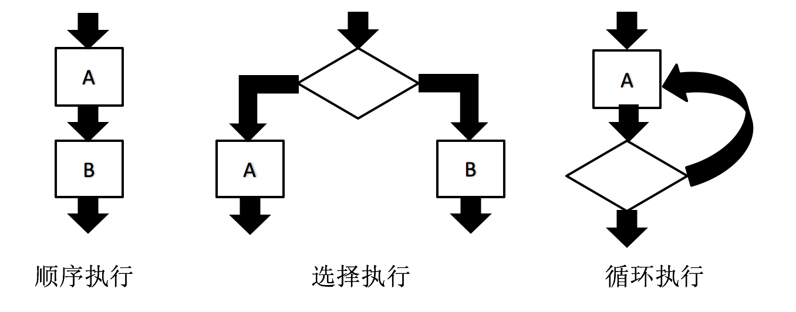

在 JavaScript 中，语句使用分号（;）进行分隔。可以在每行编写一条语句，也可以在每行编写多条语句。

语句可以被分为以下几种:

- 条件语句：JavaScript 解释器根据一个值判断是执行还是跳过指定语句。
- 循环语句：JavaScript 解释器根据一个值判断是否重复执行指定语句。
- 跳转语句：使 JavaScript 解释器跳转到指定语句。

> **注意:**
> 
> - 建议每行编写一条语句，便于提高代码的阅读性。
> - JavaScript 解释器按照语句的编写顺序依次执行。

## 语句块

JavaScript 中使用一对花括号（{}）表示一个语句块。使用语句块为语句进行分组，这样使语句的结构清晰明了。

如下示例代码所示:

```javascript
{
	var longestory = "www.longestory.com";
	console.log(longestory);
}
```

> **注意:**
> 
> - 语句块的结尾不需要分号。
> - 语句块中的行都有缩进，但并不是必需的。
> - 语句中声明变量是全局变量（后面的课程学习）。

## 空语句

空语句允许包含 0 条语句，JavaScript 解释器执行空语句时，不会执行任何动作。

空语句如下述示例代码所示:

```javascript
;
```

> **注意:** 如果有特殊目的使用空语句时，最好在代码中添加注释。这样可以更好地说明这条空语句是有用的。

## 流程控制语句

JavaScript 解释器按照语句的编写顺序依次执行，但也可以编写一些复杂的语句块，基本分为下述三种:

