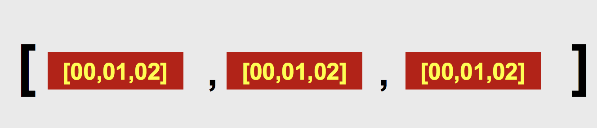

数组是可以嵌套的，这就意味着一个数组可以作为一个元素被包含在另外一个数组里面。利用 JavaScript 这个特点，创建二维数组，即数组的数组。



## 定义二维数组

#### 1. 定义一个规整的二维数组

```javascript
var arr1 = [ [11,12,13], [21,22,23], [31,32,33] ];
```

#### 2. 定义一个不规整的二维数组

```javascript
var arr2 = [];
arr2[0] = [ 101 ];
arr2[1] = [ 201, 202 ];
arr2[2] = [ 301, 302, 303 ]; 
```

## 使用二维数组

#### 读取二维数组中的具体元素

```javascript
var arr1 = [ [11,12,13], [21,22,23], [31,32,33] ] ;
console.log( arr1[0][0] );// 值为11
arr1[1][2] = 230;// 把23更改为230
```

#### 二维数组的遍历需要使用循环嵌套来实现

```javascript
for( var i = 0; i < arr1.length; i++ ){
	for( var j = 0; j < arr1[i].length; j++ ){
		console.log( arr1[i][j] );
	}
}
```